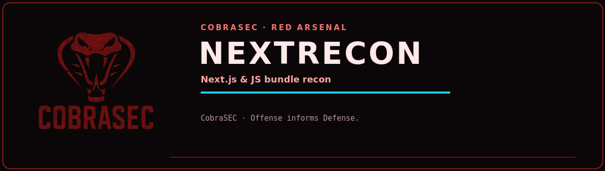

<p align="center">
  
</p>

<p align="center">
  
  
  
  
</p>

<h1 align="center">nextrecon</h1>
<p align="center"><b>Next.js & JS bundle recon — secrets, env vars, API endpoints, routes</b><br><sub><i>CobraSEC · Offense informs Defense.</i></sub></p>

---


```
 ███╗   ██╗███████╗██╗  ██╗████████╗██████╗ ███████╗ ██████╗ ██████╗ ███╗   ██╗
 ████╗  ██║██╔════╝╚██╗██╔╝╚══██╔══╝██╔══██╗██╔════╝██╔════╝██╔═══██╗████╗  ██║
 ██╔██╗ ██║█████╗   ╚███╔╝    ██║   ██████╔╝█████╗  ██║     ██║   ██║██╔██╗ ██║
 ██║╚██╗██║██╔══╝   ██╔██╗    ██║   ██╔══██╗██╔══╝  ██║     ██║   ██║██║╚██╗██║
 ██║ ╚████║███████╗██╔╝ ██╗   ██║   ██║  ██║███████╗╚██████╗╚██████╔╝██║ ╚████║
 ╚═╝  ╚═══╝╚══════╝╚═╝  ╚═╝   ╚═╝   ╚═╝  ╚═╝╚══════╝ ╚═════╝ ╚═════╝ ╚═╝  ╚═══╝
```

**Next.js & JS Bundle Recon Tool for Bug Hunters**

Automatically extracts `__NEXT_DATA__`, environment variables, secrets, API endpoints, page routes, and more from Next.js targets. Concurrently downloads and analyses all JS chunks.

---

## What It Finds

| Category | Details |
|----------|---------|
| `__NEXT_DATA__` | Full SSR data dump — props, pageProps, env, config |
| **Secrets** | AWS keys, Stripe, Firebase, JWT tokens, Slack webhooks, Sendgrid, Twilio, GitHub tokens, MongoDB URIs, private keys, and 30+ more |
| **Env Vars** | All `NEXT_PUBLIC_*` and `REACT_APP_*` variables with values |
| **API Endpoints** | Extracted from JS bundles — REST, GraphQL, WebSocket URLs |
| **Page Routes** | Full route map from `_buildManifest.js` |
| **`/_next/data/`** | Probes static JSON data endpoints for each route |
| **Exposed Files** | `.env`, `next.config.js`, `.git/config`, `package.json`, Swagger, GraphiQL |
| **Source Maps** | Detects exposed `.js.map` files (full source code leak) |
| **WAF Detection** | Cloudflare, Akamai, Fastly, AWS, Imperva |

---

## Install

```bash
git clone https://github.com/Jakkxbt/nextrecon.git
cd nextrecon
pip install -e .
```

Or run directly:
```bash
python3 nextrecon.py https://target.com
```

---

## Usage

```bash
# Single target
nextrecon https://target.com

# Single target, save report to specific dir
nextrecon https://target.com -o ~/bughunt/target/

# Faster scan (no page crawling)
nextrecon https://target.com --no-crawl

# Bulk scan from file
nextrecon -l targets.txt -o ~/bughunt/results/
```

---

## Output

- **Rich terminal** — colour-coded by severity (CRITICAL / HIGH / MEDIUM / LOW)
- **Markdown report** — auto-saved to `~/bughunt/nextrecon/` (or `-o DIR`)

---

## Secret Coverage (35+ patterns)

AWS · GCP / Google · Firebase · Stripe · Sendgrid · Twilio · Mailgun · Slack (webhook, bot & app tokens) · Sentry · Mixpanel · Segment · Mapbox · Algolia · Auth0 · Okta · GitHub tokens (classic & fine-grained) · GitLab PAT · NPM tokens · OpenAI · Anthropic · MongoDB · PostgreSQL · MySQL · Redis · JWT · Intercom · Zendesk · Ethereum private keys · Infura · Alchemy · and more.

---

## License

MIT — By CobraSEC
